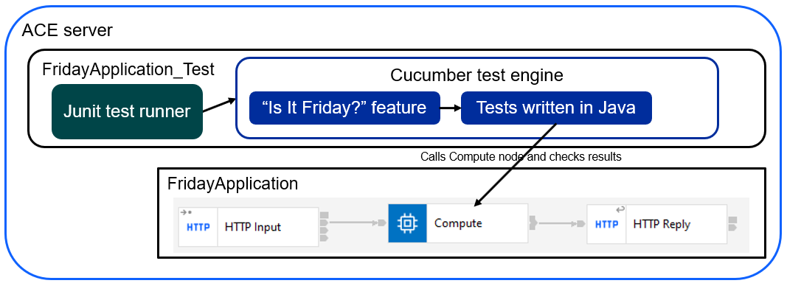

# ace-bdd-cucumber
Examples using ACE with Cucumber Behaviour-Driven Development (BDD) building on the ACE v12
test support enhancements. For background information on BDD, see the [Cucumber BDD intro](https://cucumber.io/docs/bdd/).

Many of the test constructs used in Test-Driven Development (TDD) can be used with BDD; background
information on TDD is widely available (one example from the people supporting Cucumber is at
[Basics of Test Driven Development](https://smartbear.com/blog/basics-of-test-driven-development-tdd/)
but many others exist). ACE-specific information such as videos (starting with 
[Creating and running a JUnit test for a message flow node](https://www.youtube.com/watch?v=jwnKvcUcX30&t=0s)),
documentation starting at [Developing integration tests](https://www.ibm.com/docs/en/app-connect/12.0?topic=solutions-developing-integration-tests), 
and blog posts at the IBM Integration Community (such as
[Writing JUnit Error Tests With IBM App Connect Enterprise 12](https://community.ibm.com/community/user/integration/blogs/graham-haxby/2021/07/01/writing-juint-error-tests-with-ace)).

## Overview

ACE test projects assume the use of JUnit, but can run Cucumber tests using a Cucumber-provided engine.
The engine will automatically register when JUnit starts, so no special configuration is needed.

For the [FridayApplication](FridayApplication/README.md), the Cucumber feature description in 
[is_it_friday_yet.feature](FridayApplication_Test/src/main/resources/bdd/cucumber/is_it_friday_yet.feature) 
matches the tutorial, and is picked up the Cucumber engine automatically. 
The tests in [RunCucumberTest.java](FridayApplication_Test/src/main/java/bdd/cucumber/RunCucumberTest.java) use standard 
JUnit and ACE testing constructs to implement the various steps, making sure the actual application code in 
[MainFlow_Compute.esql](FridayApplication/MainFlow_Compute.esql) works as expected.




## Usage 

The Cucumber tests can be run from the toolkit (for true BDD) and also in a pipeline for ongoing verification. 
Cucumber tests can be run alongside TDD tests using standard JUnit (as shown in one project in this repo). This
repo has been tested with ACE 12.0.7 but should work with any v12 level; earlier releases such as ACE v11 do
not have the test support code.

### Toolkit

Import this repo the ACE v12 toolkit using the built-in egit client (switch to the "git" perspective), and 
run the test projects. This should cause the cucumber BDD tests to run and pass (checked on Windows and Linux).

The projects are as follows:

- The simplest application demo is [FridayApplication](FridayApplication/README.md), showing the use of Cucumber with a single node.
    - The BDD tests for FridayApplication are in [FridayApplication_Test](FridayApplication_Test/README.md)
- BDD testing of a whole flow with multiple nodes is shown using the [WholeFlowApplication](WholeFlowApplication/README.md) project
    - The BDD tests for WholeFlowApplication are in [WholeFlowApplication_Test](WholeFlowApplication_Test/README.md)
- BDD testing with a service stubbed out is shown using the [WholeFlowWithMockedNodeApplication](WholeFlowWithMockedNodeApplication/README.md) project
    - The BDD tests with mocking of one node are in the [WholeFlowWithMockedNodeApplication_Test](WholeFlowWithMockedNodeApplication_Test/README.md) project
    - TDD testing of one node is also possible [WholeFlowWithMockedNodeApplication_TDD](WholeFlowWithMockedNodeApplication_TDD/README.md)

### Pipeline

Clone this repo using git, build the projects, and then run them using the IntegrationServer program.
See [build-and-run-tests.sh](build-and-run-tests.sh) for a script that shows the sequence of commands.

### Codespaces (experimental)

This repo can be run in a container via GitHub codespaces, which are a feature of GitHub that enables 
container-based development with VisualStudio Code in a web browser. The container in which vscode
runs is configurable, and this repo uses a container with ACE installed.

Developers get sixty hours of container runtime for free (at the time of writing), and a codespace can be launched from the "Code" menu:


The container will start up once the image has been downloaded (usually 100-150 seconds)
and vscode will start automatically. All of the usual ACE commands are present, servers
can be started as usual, etc. Running
```
./build-and-run-tests.sh
```
in the terminal will build and run the various tests for the projects.

This repo is configured to use an ACE devcontainer that can run the toolkit in a browser 
session; see https://github.com/trevor-dolby-at-ibm-com/ace-vnc-devcontainer for details on
how to access the toolkit.

There is also an ace-minimal container (run via the "New with options" menu) that can only
be used for vscode editing and running tests via the command line (no toolkit) but should 
start in 20-40 seconds depending on region.

### OpenShift Dev Spaces (experimental)

This repo can be run in a container via OpenShift Dev Spaces, which are a feature of OpenShift
that enables container-based development with VisualStudio Code in a web browser. The container
in which vscode runs is configurable, and this repo is configured to use an ACE devcontainer
that can run the toolkit in a browser session; see https://github.com/trevor-dolby-at-ibm-com/ace-dev-spaces-container
for details on how to build/run the container images and access the toolkit.

## Integration with pipeline reporting

As well as the pass/fail aspect of test reporting, Cucumber can also generate output that 
is compatible with pipeline tooling to record which tests have been run and also any console 
output. The [Cucumber docs](https://cucumber.io/docs/cucumber/reporting) describe various
plugins, and three have been tested in this repo: JSON, JUnit, and HTML. The `cucumber.plugin` 
setting in junit-platform.properties specifies which plugins will be loaded and used, and 
can contain multiple entries. For example,
```
cucumber.plugin=pretty,json:target/cucumber-reports/Cucumber.json,junit:target/cucumber-reports/Cucumber.xml,html:target/cucumber-reports/Cucumber.html
```
will cause Cucumber to generate colourised test results on the console and also create
JSON, JUnit XML, and HTML output in the `target/cucumber-reports` directory. The paths 
are relative to the working directory, and if the tests are run from the toolkit then
the project may need to be "refreshed" before the files become visible in the Eclipse 
navigator due to the files being created outside Eclipse.

Commented-out settings are shown in the [FridayApplication_Test junit-platform.properties](FridayApplication_Test/src/main/resources/junit-platform.properties) 
and can be enabled to show the various output formats.

## Details

Some issues arise when running Cucumber in ACE v12:

- Cucumber tries to auto-detect test Java code for the steps, but this does not always work as expected. Use the `cucumber.glue` setting in junit-platform.properties to point Cucumber at the correct package (see [junit-platform.properties](FridayApplication_Test/src/main/resources/junit-platform.properties) for an example).
- The detection may also fail if the JAR containing the tests does not have directory entries for the package. This is very unusual, as most JAR builders create directories, but can cause problems if it does happen.
- Error reporting from Cucumber initialization is limited; most configuration issues result in Cucumber simply not running tests.

## Future enhancements

Use Maven instead of copying JARs around (see `maven` branch).
