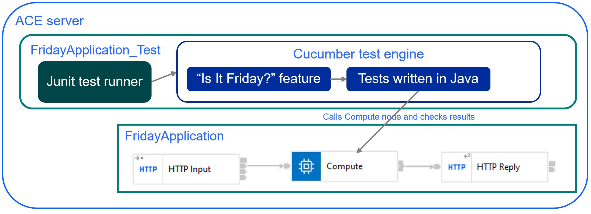

# ace-bdd-cucumber
Examples using ACE with Cucumber Behaviour-Driven Development (BDD) building on the ACE v12
test support enhancements. For background information on BDD, see the [Cucumber BDD intro](https://cucumber.io/docs/bdd/).

Many of the test constructs used in Test-Driven Development (TDD) can be used with BDD; background
information on TDD is widely available (one example from the people supporting Cucumber is at
[Basics of Test Driven Development](https://smartbear.com/blog/basics-of-test-driven-development-tdd/)
but many others exist). ACE-specific information such as videos (starting with 
[Creating and running a JUnit test for a message flow node](https://www.youtube.com/watch?v=jwnKvcUcX30&t=0s)),
documentation starting at [Developing integration tests](https://www.ibm.com/docs/en/app-connect/12.0?topic=solutions-developing-integration-tests), 
and blog posts at the IBM Integration Community (such as
[Writing JUnit Error Tests With IBM App Connect Enterprise 12](https://community.ibm.com/community/user/integration/blogs/graham-haxby/2021/07/01/writing-juint-error-tests-with-ace)).

## Overview

ACE test projects assume the use of JUnit, but can run Cucumber tests using a Cucumber-provided engine.
The engine will automatically register when JUnit starts, so no special configuration is needed.

For the [FridayApplication](FridayApplication/README.md), the Cucumber feature description in 
[is_it_friday_yet.feature](FridayApplication_Test/src/main/resources/bdd/cucumber/is_it_friday_yet.feature) 
matches the tutorial, and is picked up the Cucumber engine automatically. 
The tests in [RunCucumberTest.java](FridayApplication_Test/src/main/java/bdd/cucumber/RunCucumberTest.java) use standard 
JUnit and ACE testing constructs to implement the various steps, making sure the actual application code in 
[MainFlow_Compute.esql](FridayApplication/MainFlow_Compute.esql) works as expected.




## Usage 

The Cucumber tests can be run from the toolkit (for true BDD) and also in a pipeline for ongoing verification. 
Cucumber tests can be run alongside TDD tests using standard JUnit (as shown in one project in this repo). This
repo has been tested with ACE 12.0.5 but should work with any v12 level; earlier releases such as ACE v11 do
not have the test support code.

### Toolkit

Import this repo the ACE v12 toolkit using the built-in egit client (switch to the "git" perspective), and 
run the test projects. This should cause the cucumber BDD tests to run and pass (checked on Windows and Linux).

### Pipeline

Clone this repo branch using git and run
```
mvn verify
```
to download dependencies, build the flows and tests, and then run the tests.

## Details

Some issues arise when running Cucumber in ACE v12:

- Cucumber tries to auto-detect test Java code for the steps, but this does not always work as expected. Use the `cucumber.glue` setting in junit-platform.properties to point Cucumber at the correct package (see [junit-platform.properties](FridayApplication_Test/src/main/resources/junit-platform.properties) for an example).
- The detection may also fail if the JAR containing the tests does not have directory entries for the package. This is very unusual, as most JAR builders create directories, but can cause problems if it does happen.
- Error reporting from Cucumber initialization is limited; most configuration issues result in Cucumber simply not running tests.

