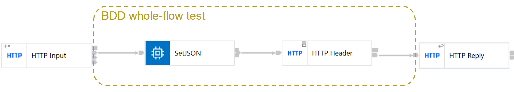

# WholeFlowApplication

An example of running Cucumber BDD tests to verify the behaviour of a whole flow
rather than a single node.

## Usage 

Import into the ACE v12 toolkit, and run the test project. This should cause the cucumber BDD tests to run 
and pass (checked on Windows and Linux).
