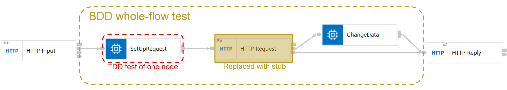

# WholeFlowWithMockedNodeApplication

An example of running Cucumber BDD tests to verify the behaviour of a whole flow
rather than a single node, with a message flow node stubbed out to avoid requiring
the dependent service to be available. This application also has a TDD-style test
project associated with it to verify the behaviour of a single node in the flow.

## Usage 

Import into the ACE v12 toolkit, and run the test project. This should cause the cucumber BDD tests to run 
and pass (checked on Windows and Linux).
